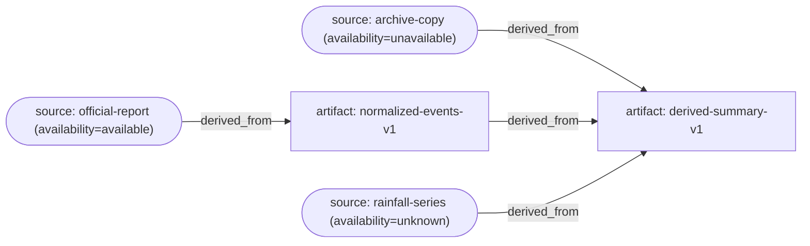

# LineageGuard

[](https://github.com/KageRyo/LineageGuard/actions/workflows/ci.yml) [](LICENSE)

LineageGuard is a local command line tool for checking artifact identity, source provenance, and declared upstream lineage. It answers which inputs an artifact names, whether local copies still match their declared SHA-256 digests, and which provenance gaps remain explicit.

LineageGuard reads a `lineage.yaml` manifest and local files only. It does not fetch URLs, validate dataset schemas or rows, transform data, manage workflows, or host a catalog. ReleaseGuard checks dataset structure such as field types, uniqueness, references, timestamp order, and release-file integrity; LineageGuard follows source and artifact identities across declared derivation edges.

## Install a release binary

Each GitHub release provides standalone archives for Linux x64, Windows x64, and macOS ARM64, plus `SHA256SUMS`. Archives contain the executable and license notices. The Linux x64 binary requires glibc 2.34 or newer; release CI checks its ELF version requirements and starts it in an Ubuntu 22.04 container.

| Platform | Archive |
| --- | --- |
| Linux x64 | `lineageguard-v0.3.0-linux-x86_64.tar.gz` |
| Windows x64 | `lineageguard-v0.3.0-windows-x86_64.zip` |
| macOS ARM64 | `lineageguard-v0.3.0-macos-aarch64.tar.gz` |

Download the archive for your platform and `SHA256SUMS` from the [v0.3.0 release](https://github.com/KageRyo/LineageGuard/releases/tag/v0.3.0), then verify the downloaded archive before extracting it:

```sh
grep '  lineageguard-v0.3.0-linux-x86_64.tar.gz$' SHA256SUMS | sha256sum --check
tar -xzf lineageguard-v0.3.0-linux-x86_64.tar.gz
./lineageguard --help
```

On macOS, verify the ARM64 archive with `shasum` before extracting it:

```sh
grep '  lineageguard-v0.3.0-macos-aarch64.tar.gz$' SHA256SUMS | shasum -a 256 --check
tar -xzf lineageguard-v0.3.0-macos-aarch64.tar.gz
```

For the Windows ZIP, compare its `Get-FileHash -Algorithm SHA256` result with the matching entry in `SHA256SUMS` before using `Expand-Archive`.

## Build

Install Rust 1.85 or newer, then build the standalone binary:

```sh
cargo build --release --locked
./target/release/lineageguard --help
```

The executable needs no Python or Node.js runtime. Validation and verification make no network requests.

## Quick start

```sh
lineageguard validate examples/basic-lineage
lineageguard verify examples/basic-lineage
lineageguard lineage derived-summary-v1 examples/basic-lineage
lineageguard graph examples/basic-lineage
lineageguard diff examples/manifest-diff/v1.yaml examples/manifest-diff/v2.yaml
lineageguard audit examples/basic-lineage
```

Commands accept either a project directory containing `lineage.yaml` or a direct path to a manifest file. `--format json` returns deterministic machine-readable reports.

The basic example contains synthetic source and artifact files. Its report source is pinned to a local snapshot, then feeds a normalized artifact and a derived summary. Two additional sources are explicitly unknown and unavailable. `validate` and `verify` succeed; `audit` exits 1 and reports those deliberate provenance gaps.

## Manifest version 1

The manifest has one integer version, globally unique source and artifact IDs, and directed lineage edges. An edge points from an input to the artifact derived from it. Version 1 supports `derived_from`; its target must be an artifact, while its input may be a source or another artifact. A source marked `not_applicable` cannot be used as a lineage input.

```yaml
version: 1
sources:
  official-report:
    status: available
    locator: https://example.gov/report
    version: 2026-edition
    revision: archive-copy-1
    retrieved_at: "2026-09-01T10:00:00Z"
    rights: public-domain
    snapshot:
      path: sources/report.pdf
      sha256: 0123456789abcdef0123456789abcdef0123456789abcdef0123456789abcdef
      size_bytes: 4096
  unavailable-archive:
    status: unavailable
    locator: https://example.gov/old-report
artifacts:
  normalized-events-v1:
    path: data/events.csv
    sha256: 0123456789abcdef0123456789abcdef0123456789abcdef0123456789abcdef
    size_bytes: 512
    version: v1
lineage:
  - from: official-report
    to: normalized-events-v1
    type: derived_from
  - from: unavailable-archive
    to: normalized-events-v1
    type: derived_from
```

Artifact IDs and source IDs share one namespace. Repeated YAML keys, duplicate edges, conflicting digest or size declarations for one path, unknown IDs, unsupported relationship types, malformed digests, and unsupported manifest versions are rejected. A declared local artifact path requires a SHA-256 digest. A source snapshot always requires both a path and a digest; source snapshots are optional because a remote source may be known without a retained local copy.

Artifacts without a local path may remain in lineage metadata, but `verify` reports `artifact_not_materialized` for them.

Source status describes declared availability, independently of local verification:

| Source status | Meaning | `verify` when no snapshot is declared | `audit` |
| --- | --- | --- | --- |
| `available` | The source is declared obtainable. | Reports unverified; does not fetch it. | Reports a gap if no immutable local snapshot is pinned. |
| `unavailable` | The source is known to be unavailable. | Preserves the status without failing integrity checks. | Reports `source_unavailable`. |
| `unknown` | Availability has not been established. | Preserves the status without failing integrity checks. | Reports `source_unknown`. |
| `not_applicable` | The source does not apply to this manifest. | Preserves the status without failing integrity checks. | Does not report an availability gap. |

A local snapshot can still be hash-verified while its source availability remains unknown or unavailable. A verified SHA-256 proves that the bytes match the manifest declaration; it does not prove who published those bytes, that a locator is authentic, or that a transformation can be replayed.

## Commands and results

```sh
lineageguard validate [PATH]
lineageguard verify [PATH]
lineageguard lineage <ARTIFACT_ID> [PATH]
lineageguard audit [PATH]
lineageguard graph [PATH] [--format mermaid|dot]
lineageguard diff OLD NEW [--format text|json]
```

`validate` checks the manifest schema, IDs, references, digest syntax, path safety, duplicate edges, and dependency cycles. It does not require declared files to exist or hash them. `verify` streams local artifact and snapshot bytes through SHA-256 and checks an optional declared size; it never prints file contents or downloads remote locators. Unknown and unavailable sources without snapshots do not count as integrity failures.

`lineage` prints the requested artifact's upstream tree in stable ID order, including source locator, version, revision, availability, and local verification status where declared. JSON output keeps those fields separate. It reports cycles safely and limits integrity findings to the requested upstream chain.

`audit` combines local integrity checks with provenance gaps. It reports artifacts without upstream lineage, unpinned available sources, unknown or unavailable sources, dependency cycles, and mutable path declarations. It does not calculate a quality score.

`graph` prints all declared source and artifact nodes, including isolated nodes, and every `derived_from` edge. It defaults to Mermaid and also supports Graphviz DOT:

```sh
lineageguard graph examples/basic-lineage --format mermaid
lineageguard graph examples/basic-lineage --format dot
```

The graph shows declared provenance and source availability only. It does not read local payloads or claim that their hashes have been verified. A dependency cycle exits with status `1`; invalid manifests and unsafe paths exit with status `2`. Rebuild the Mermaid graph above with `lineageguard graph examples/basic-lineage`.



`diff` compares source and artifact entries by ID, including changed fields, and compares lineage edges by direction and relationship type. It also reports a changed manifest version. Additions and removals include their declared fields. Output order is independent of YAML map or edge order. The command does not validate lineage semantics, read payload files, or verify hashes; run `validate` or `verify` for those checks. A completed comparison exits `0` whether or not changes exist; malformed input exits `2`.

```sh
lineageguard diff examples/manifest-diff/v1.yaml examples/manifest-diff/v2.yaml
lineageguard diff old.yaml new.yaml --format json
```

The example reports source, artifact, and edge counts, then shows the changed IDs and field values. JSON includes the same summary and field-level changes for CI consumers.

Exit codes are `0` for a successful command, `1` for an integrity failure, dependency cycle, or audit finding, and `2` for invalid configuration, malformed input, unsafe paths, or execution errors. Explicit unknown and unavailable source states alone do not make `verify` fail; they do make `audit` report an incomplete chain.

All data paths in the manifest must be relative, use `/`, and stay inside the project root after symlink resolution. Absolute paths, Windows drive paths, `.` or `..` components, backslashes, Windows-reserved characters or device names, and components ending in a dot or space are rejected. An in-root symlink is accepted but reported by `audit` as `mutable_path`; a symlink that resolves outside the root is rejected. A path component named `current` is accepted and reported as mutable by `audit`.

Successful JSON reports use sorted checks and findings, stable object fields, and no generated timestamp. Error reports use stable reason codes such as `invalid_manifest`, `unsafe_path`, and `unknown_artifact`.

## GitHub Action

After checking out the dataset, use the composite Action to validate `lineage.yaml` and verify its declared local files:

```yaml
- uses: actions/checkout@v5
- uses: KageRyo/LineageGuard@v0.3.0
  with:
    path: .
```

The `path` input defaults to `.` and must resolve inside the checked-out workspace. The Action runs on Linux x64 and does not run the provenance-gap `audit`; add an explicit `lineageguard audit` CLI step when that policy should gate CI.

## Examples

`examples/basic-lineage` is the valid synthetic example. `examples/invalid-integrity`, `examples/invalid-graph`, and `examples/invalid-path` demonstrate a hash mismatch, a dependency cycle, and a rejected traversal path. Their expected exit codes are 1, 1, and 2 respectively.

## Limits

Version 1 records artifact-level lineage only. It does not map individual records to sources, execute or record transformation code, fetch remote data, enforce immutable storage, authenticate source publishers, sign manifests, or prove reproducibility of a transformation. Source timestamps and rights are preserved as metadata and are not independently interpreted.

## License

LineageGuard is licensed under [Apache-2.0](LICENSE). Third-party dependency license notices are listed in [THIRD-PARTY-LICENSES.txt](THIRD-PARTY-LICENSES.txt).

## Maintenance

See [maintenance conventions](docs/maintenance.md) for dependency updates, required CI, Action pinning and release validation.
